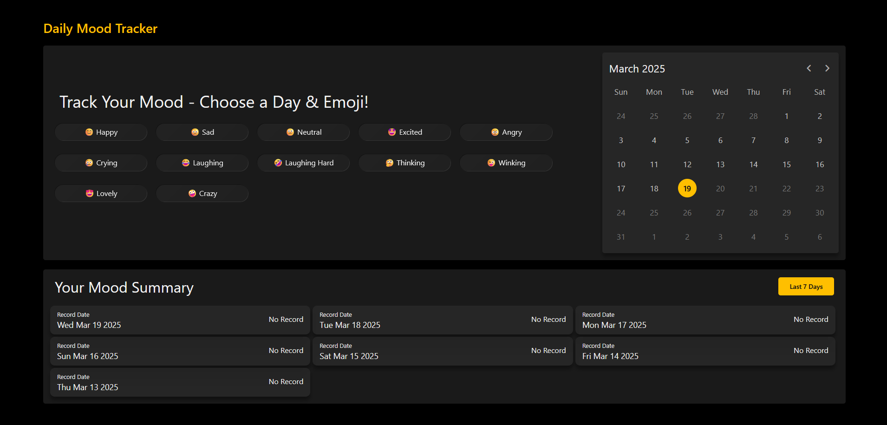

# About Mood Tracker
## Introduction
Welcome to the Github repository for **Mood Tracker**. A simple and fun way to track your emotions! Log your daily mood using emojis and generate insightful reports to understand your emotional trends over time.
## Features
- **Log Your Mood** - Select an emoji that represents your mood for today or any past date.
- **12 Mood Options** - Choose from Happy, Sad, Neutral, Excited, Angry, Crying, Laughing, Laughing Hard, Thinking, Winking, Lovely, and Crazy.
- **Past Entry Updates** - Modify your mood entries for any past date whenever you want.
- **Data Selection** - You can log moods only for today or past dates (future dates are restricted).
- **Mood Summary Report** - View a summary of your moods over a selected time period:
Last 7 days
Last 15 days
Last 30 days
Last 45 days
- **Manual Selection** - You can view mood selections beyond the last 45 days by manually selecting a specific date in the calendar. This allows you to revisit and analyze mood entries from earlier dates easily.
## How it Works
- Jump In & Log your Mood - Select an emoji that matches your feeling and save it for the chosen date.
- Modify Anytime - Want to update your past mood entries? No Problem, just pick up the relevant date and select a new mood that you feel.
- Track your Emotions - Generate the insightful reports to see how your mood has fluctuated over time.
- Refresh Report - To load the latest selected moods, simply re-select the report generation option. This ensures that the report reflects the most up-to-date data. Auto reload of report is not enabled.
## Screenshots
Here's how the app looks:
- Initial Home Page

- User choose their mood

- Report Updated

## Tech Stack
- HTML, CSS & JS